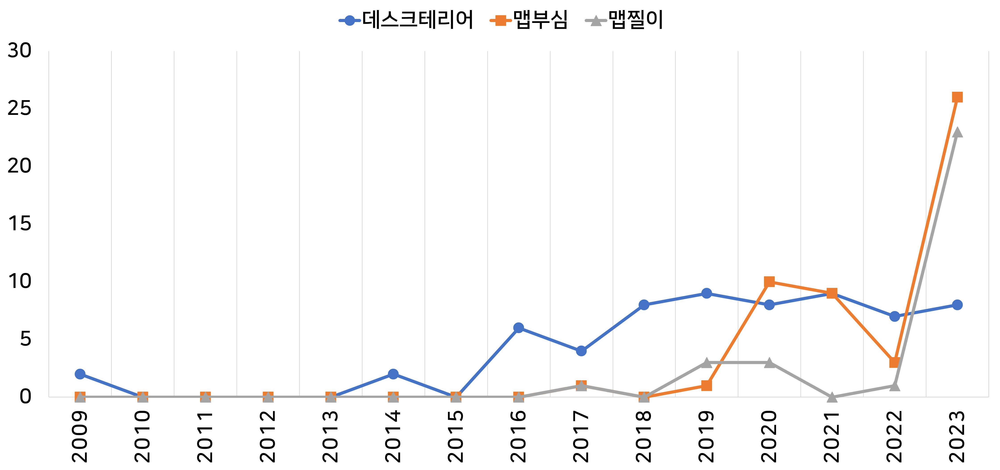
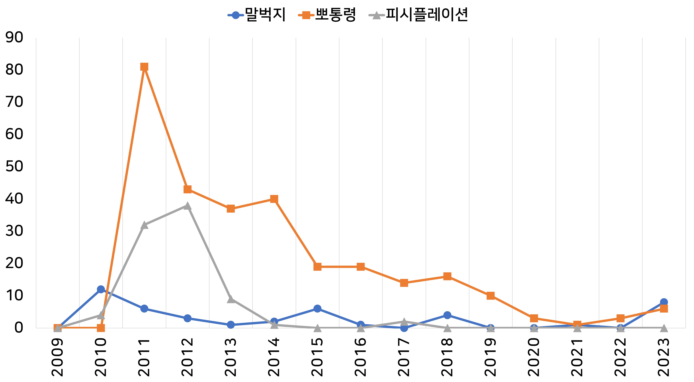
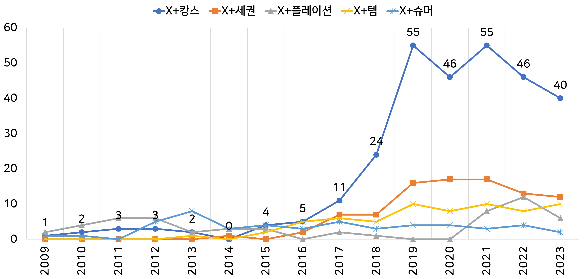

# KBWD: Korean Blended Words Dataset

## 1. 개요

**KBWD**는 2008년 9월 1일 이후 <네이버 뉴스>(인링크)에서 최초로 출현한 한국어 혼성어 772개에 대한 데이터베이스입니다.
각 혼성어에 대해 다음과 같은 정보를 제공합니다.

- 최초 출현 연도(<네이버 뉴스> 기준, 말뭉치 기준)
- 혼성어 구성 요소(X, Y) 각각의 원어 및 어종 정보
- 혼성어 구성 요소의 파편
- 혼성어의 연도별(2009~2023, 국립국어원 <신문 말뭉치> 기준) 절대빈도

## 2. 혼성어의 상대빈도 추이 예시(/100M tokens)

## 3. 혼성어 파편의 타입 빈도 추이 예시

## 4. 참고문헌

- 안진산(2024), 「한국어 혼성어 빈도 조사」, 한국사전학회 제44차 전국학술대회 발표자료집.

---

## 🧑‍🏫 기여자

- **안진산**
  경북대학교 국어국문학과 외래교수 | 언어정보연구센터 연구원
  📧 san@knu.ac.kr

---