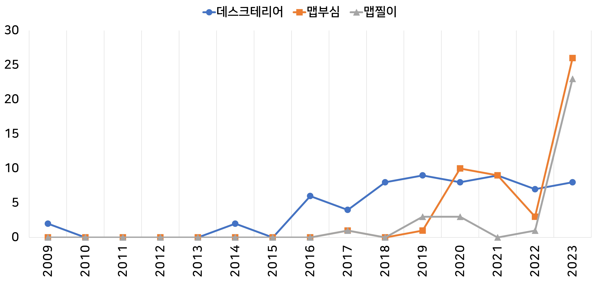
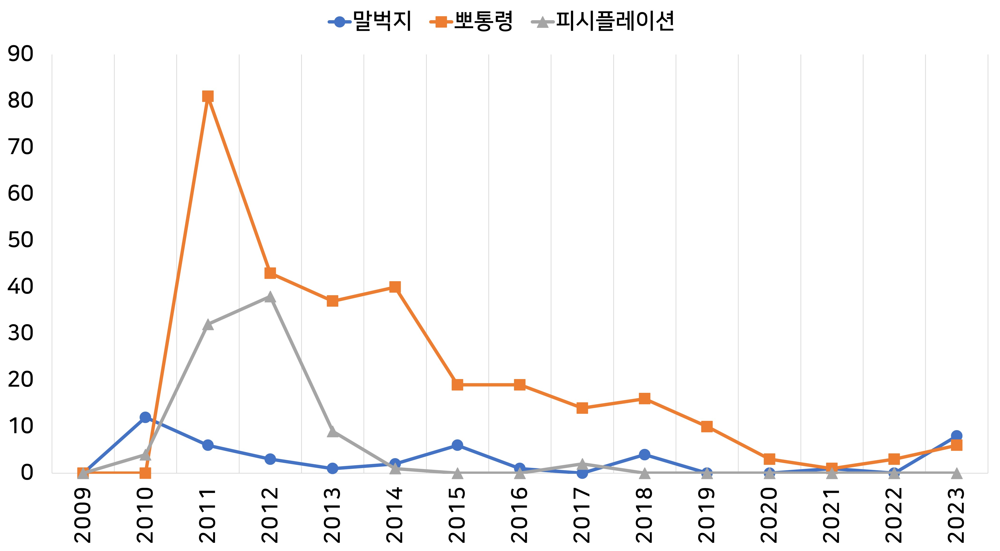
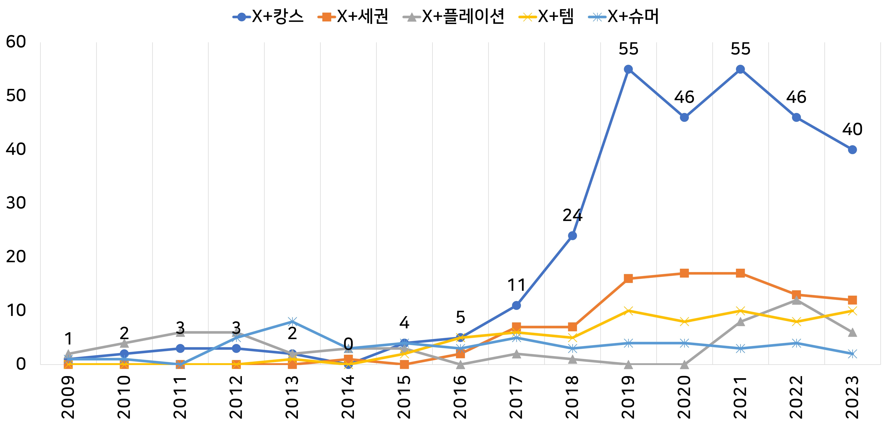

# KBWD: Korean Blended Words Dataset

## 1. 개요

**KBWD**는 2008년 9월 1일 이후 <네이버 뉴스>(인링크)에서 최초로 출현한 한국어 혼성어에 대한 데이터베이스입니다.
각 혼성어에 대해 다음과 같은 정보를 제공합니다.

- 최초 출현 연도(<네이버 뉴스> 기준, 말뭉치 기준)
- 혼성어 구성 요소(X, Y) 각각의 원어 및 어종 정보
- 혼성어 구성 요소의 파편
- 혼성어의 연도별(2009~2023, 국립국어원 <신문 말뭉치> 기준) 절대빈도

## 2. 혼성어의 상대빈도 추이 예시(/100M tokens)

## 3. 혼성어 파편의 타입 빈도 추이 예시

## 4. 혼성어 음절 N-Gram을 활용한 규칙 기반 혼성어 탐지

- 〈혼성어 DB〉에서 추출한 음절 N-Gram을 통해 새로운 혼성어를 탐지하는 규칙 기반 알고리즘 예시입니다. 
👉 [Google Colab 예제 바로가기](https://colab.research.google.com/drive/1DR9yHMDdAt9SfD0It69qLx1oAB2rFGPG?usp=sharing) 

## 5. 혼성어 자동 탐지 알고리즘

- Google Vertex AI에 기반한 혼성어 자동 탐지 알고리즘도 곧 공개될 예정입니다! 

## 6. 사사표기

- <한국어 혼성어 자동 탐지를 위한 언어공학적 연구>(2025년 한국연구재단 인문사회학술연구교수 B유형)
- 이 논문은 2025년 대한민국 교육부와 한국연구재단의 지원을 받아 수행된 연구임 (NRF-2025S1A5B5A17018170)

---